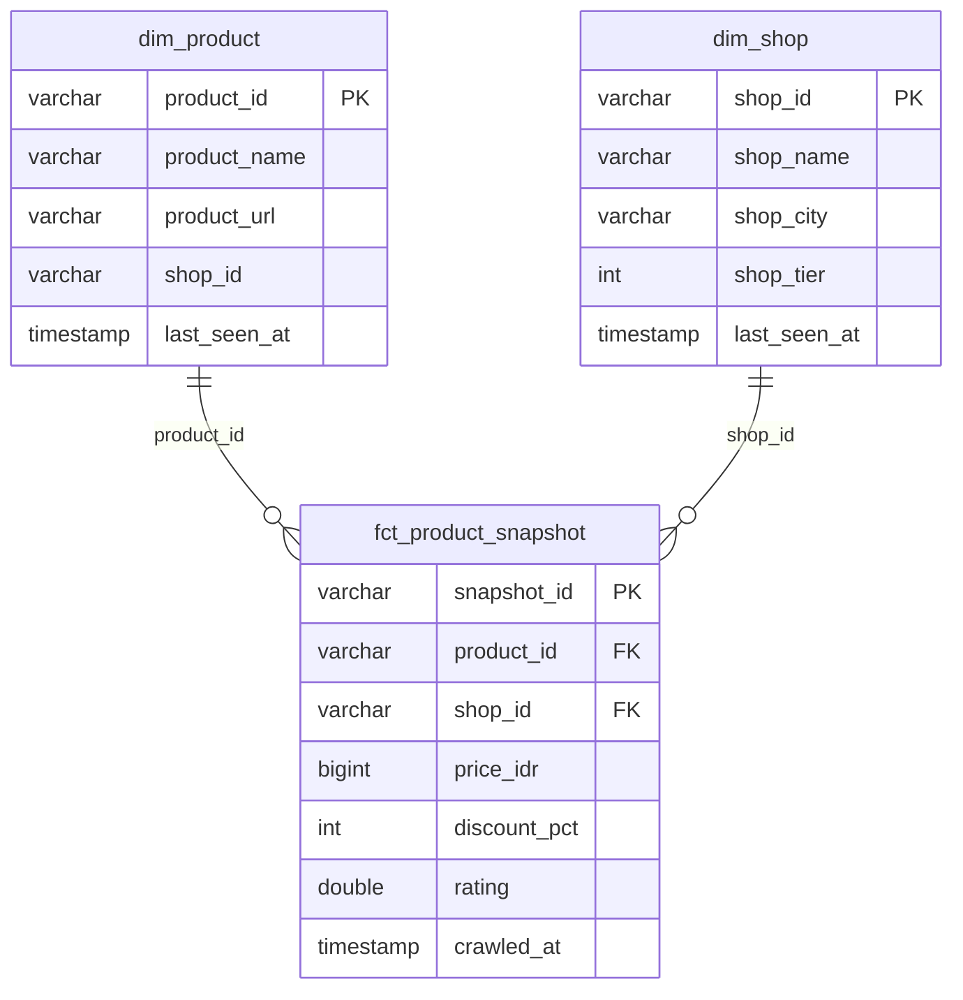

# E-Commerce End-to-End Crawler

[](https://github.com/mhmdwldn/ecommerce-crawler/actions/workflows/ci.yml)

End-to-end streaming data pipeline: **Tokopedia crawler → Kafka → Spark Structured Streaming → Delta Lake medallion on MinIO → dbt star schema → Postgres mart + ClickHouse serving**, orchestrated with **Airflow**.

📖 **New to this project?** Start with the [Architecture Guide](docs/architecture.md) — explains the full data flow, every layer, and why each technology was chosen. Indonesian, beginner-friendly.

The crawler itself is a production-ready, config-driven scraper for **Tokopedia**'s public storefront GraphQL gateway (`gql.tokopedia.com`). Everything downstream of the crawler — bronze/silver/gold layers, the mart, and the DAG that ties them together — is built and verified end-to-end.

## Architecture

```
Airflow (daily) ─> Crawler ─> Kafka ─> Spark Structured Streaming ─> BRONZE (Delta @ MinIO)
                                                                        │ Spark batch
                                                                     SILVER (Delta @ MinIO)
                                                                        │ dbt (DuckDB)
                                                                      GOLD (star schema) ─> Postgres mart
Optional real-time sink: Kafka ─> Elasticsearch ─> Kibana
```

| Layer | Technology | What happens |
|---|---|---|
| Ingestion | Tokopedia crawler (async `httpx`) → Kafka (`aiokafka`) | Async crawl of the storefront GraphQL API, published as JSON events to `tokopedia.products.raw` |
| Bronze | Spark Structured Streaming (`pipeline/spark/stream_bronze.py`) | Reads the Kafka topic, writes raw JSON + Kafka metadata (offset, partition, timestamp) to a Delta table on MinIO, checkpointed for exactly-once ingestion |
| Silver | Spark batch (`pipeline/spark/silver.py`) | Parses and flattens bronze JSON into a typed schema, deduplicates, quarantines unparseable rows into a `_rejects` Delta table instead of failing the job |
| Gold | dbt on DuckDB (`pipeline/dbt/`) | Star schema over silver: `dim_product`, `dim_shop`, `fct_product_snapshot`, with dbt tests on keys |
| Mart | Postgres (`pipeline/load/load_to_postgres.py`) | Gold tables loaded from DuckDB into Postgres via `ATTACH ... (TYPE postgres)`, full reload per run |
| Orchestration | Airflow DAGs `tokopedia_products` + `tokopedia_retry` | `crawl_assets >> bronze >> silver >> quality_check >> dbt_build >> [load_postgres, load_clickhouse] >> write_audit`, `@hourly` + manual retry, pool-serialized |
| Quality | `pipeline/quality/checks.py` | 5 validations (row_count, null%, price>0, rejects%, freshness) — fails DAG before bad data reaches mart |
| Audit | `pipeline/quality/audit.py` | `pipeline_runs` table in ClickHouse — one row per DAG execution |
| Alerting | `pipeline/airflow/alerting.py` | `on_failure_callback` webhook (Telegram/Discord/Slack/ntfy), config via env |
| BI | Metabase + Superset | Dual BI tools, 5 dashboards (price trend, price drops, shop/city, pipeline health, asset health) |
| Monitoring | Prometheus + Grafana | 16-service health dashboard, Alertmanager webhook alerting |
| Secrets | HashiCorp Vault (dev) | Centralized secret storage, Airflow Vault backend |
| CI/CD | GitHub Actions | 5 test jobs + build → push GHCR → smoke test |
| Deploy | `deploy.sh` + CD auto-deploy | Self-hosted runner: push → pull → restart → health check (fully automated) |
| Backup | `backup.sh` | Daily PG + CH + MinIO; DR restore tested (RTO <10 min) |
| Retention | DAG `data_retention` | @monthly VACUUM bronze 90d, silver 180d |
| Reverse Proxy | Caddy | `:8081` → all services (single entrypoint) |
| Logging | Fluent Bit → ES → Kibana | Docker log aggregation |
| K8s | Helm chart | `deployment/helm/` — 18-service full stack |
| Cold Storage | `retention.py --cold-storage` | Export Parquet before VACUUM |
| TLS | `deployment/tls-config.md` | TLS guide for all services |
| Control Plane | Asset Registry (`assets/`) | Streamlit UI → Postgres `control.crawl_assets` → DAG auto-fan-out, circuit breaker after 5 failures |

| Logging | loguru (`source/`) + print + Spark | InterceptHandler captures all stdlib logging → loguru format with colors |
| Maintenance | Airflow DAG `lakehouse_maintenance` | `@weekly` OPTIMIZE + VACUUM bronze/silver Delta, OPTIMIZE FINAL ClickHouse dims |

Elasticsearch/Kibana remain wired up as an optional real-time sink (crawl → Elasticsearch, searchable immediately, no batch layer involved) — useful for real-time search/analytics demos independent of the medallion pipeline.

## Mart data model



`fct_product_snapshot` is grained at one row per product per crawl: `snapshot_id = md5(product_id || '|' || crawled_at)`. `dim_product` and `dim_shop` keep only the latest-seen attributes per key (`row_number() over (partition by ... order by crawled_at desc) = 1`), so the mart always reflects the freshest product/shop metadata while the fact table retains full history.

## Quickstart (< 15 menit)

```bash
# 1. Clone + setup
git clone https://github.com/mhmdwldn/ecommerce-crawler
cd ecommerce-crawler
pip install -r source/requirements.txt

# 2. Scrape langsung ke stdout (no Docker needed)
cd source
python main.py crawler --type search-product --keyword "poco f8" --pretty

# 3. Full pipeline (butuh Docker)
bash start.sh                              # startup berurutan: ZK→Kafka→PG→DDL+seed→infra→sisanya
make smoke KEYWORD="sepatu running"       # setup infra + crawl → Kafka

# 4. Trigger DAG
docker exec airflow airflow dags trigger tokopedia_products
# Manual retry (single asset from Streamlit):
docker exec airflow airflow dags trigger tokopedia_retry --conf '{"keyword":"poco f8","max_pages":2,"asset_id":1}'

# 5. Buka dashboard
# Airflow:    http://localhost:8080  (admin / admin)
# Metabase:   http://localhost:3000  (setup first-run)
# Superset:   http://localhost:8088  (admin / admin)
# MinIO:      http://localhost:9001  (minioadmin / minioadmin)
# Kibana:     http://localhost:5601
```

```bash
# Query langsung ke mart
docker compose -f source/deployment/compose.yaml exec postgres psql -U mart -d mart \
  -c "SELECT count(*) FROM fct_product_snapshot;"
docker compose -f source/deployment/compose.yaml exec clickhouse clickhouse-client \
  --user ch_user --password ch_pass --query "SELECT count() FROM analytics.fct_product_snapshot"
```

Pipeline idempotent — rerun aman, data tidak duplikasi. Setiap DAG run (@hourly) baca asset registry, crawl 10 keyword, validasi quality, update Postgres + ClickHouse.

### Operational notes

- **New DAG registration lag.** Airflow's scheduler only picks up a freshly added DAG file on its `dag_dir_list_interval` sweep (default 300s). If `airflow dags trigger` reports the DAG as not found right after adding it, either wait or force a sync with `airflow dags reserialize`.
- **First unpause fires a catch-up run.** A brand-new `@daily` DAG is created paused; unpausing it schedules one run for the most recently due interval (even with `catchup=False`, which only suppresses *older* backfill). Expect to see that scheduled run execute alongside your first manual trigger — harmless here since every stage of the pipeline is idempotent (full overwrite in silver, `DROP`+`CREATE` in the Postgres load).
- **Airflow standalone password is ephemeral.** The admin password is generated fresh on first startup and stored in `/opt/airflow/standalone_admin_password.txt` inside the container. If you delete the `airflow-data` volume, a new password is generated — retrieve it again with step 2 above.

### Makefile shortcuts

```bash
make start                        # bash start.sh (startup berurutan + DDL + seed)
make up                           # docker compose up -d --build (quick restart)
make down                         # docker compose down
make crawl KEYWORD="poco f8"      # scrape search-product to stdout
make smoke KEYWORD="poco f8"      # full end-to-end: setup infra → crawl Kafka → verify offsets
make test                         # crawler unit tests (source/tests/)
make test-pipeline                # pipeline tests (inside airflow container)
make test-all                     # all three test suites
make lint                         # ruff check
make lint-fix                     # ruff auto-fix
make clean                        # down + remove all volumes
```

### Troubleshooting

| Symptom | Cause | Fix |
|---|---|---|
| Kafka exits with `NodeExistsException` | Zookeeper stale broker ID from previous run | `bash start.sh` (handles ordering) or `docker compose down && docker compose up -d` |
| `v_due_assets`/`control.crawl_assets` not found | Postgres container fresh/recreated, DDL not auto-applied | `bash start.sh` auto-applies DDL+seed; manual: `cat assets/ddl/crawl_assets.sql \| docker exec -i postgres-mart psql -U mart -d mart` |
| Airflow shows "Already running on PID" | Stale PID files in `airflow-data` volume | `docker volume rm ecommerce-crawler_airflow-data` and restart |
| `stream_bronze` fails with "offset was changed" | Delta checkpoint references old Kafka offsets (topic was recreated) | Delete checkpoint objects from bucket `lakehouse/_checkpoints/bronze_products/` |
| `ModuleNotFoundError: No module named 'clickhouse_connect'` | Airflow image stale, dependency not installed | Rebuild: `docker compose -f source/deployment/compose.yaml build airflow --no-cache && docker compose -f source/deployment/compose.yaml up -d airflow` |
| Airflow API returns 401 Unauthorized | Airflow 2.10.4 uses session auth (no basic auth by default) | Fixed in compose.yaml (`AIRFLOW__API__AUTH_BACKENDS`). If missing, add it and restart Airflow. |
| Asset status stuck at "pending" after DAG | `crawl_assets.py` didn't handle `CRAWL_ASSET_ID` | Fixed in latest code. Pull latest and retry. |
| `ModuleNotFoundError: No module named 'pipeline'` | PYTHONPATH not set to repo root | Run with `PYTHONPATH=/opt/airflow/repo python pipeline/...` |
| `docker exec` mangles Linux paths on Windows | Git Bash path translation | Use `docker exec <name> bash -c "<cmd>"` instead of bare path |

These are documented in detail in [baseline notes](docs/baseline-notes.md#fase-0--validasi-baseline).

## Cloud mapping

This stack runs entirely local (MinIO, local Kafka/Spark/Airflow, DuckDB), but every component maps directly onto a managed AWS equivalent:

| Local component | AWS equivalent |
|---|---|
| MinIO | S3 |
| Kafka (Confluent images) | MSK or Kinesis |
| Spark (Structured Streaming + batch) | EMR or Glue |
| Airflow (standalone) | MWAA |
| Postgres mart | RDS (Postgres) |

Configuration is endpoint-driven via environment variables (`MINIO_ENDPOINT`, `spark.hadoop.fs.s3a.*`, `DUCKDB_S3_ENDPOINT`, `POSTGRES_DSN`, etc.) — pointing those at real S3/RDS/MSK endpoints is a config change, not a code change.

## Data quality & error handling

- **Checkpointed streaming ingestion** — bronze runs with `trigger(availableNow=True)` and a Delta checkpoint on MinIO, so Airflow can invoke it per-run without a 24/7 streaming daemon, and a re-run never double-reads a Kafka offset.
- **`_rejects` quarantine** — silver never fails the job on malformed data; rows that don't parse or have no product id go to a separate `_rejects` Delta table with the raw payload for later inspection, while valid rows still flow through.
- **dbt tests on gold** — 7 tests (`unique` + `not_null`) covering the primary keys of `dim_product`, `dim_shop`, and `fct_product_snapshot`, run as part of `dbt build` in the DAG so a broken model fails the pipeline loudly instead of silently corrupting the mart.
- **Airflow retries** — every task in `tokopedia_products` gets one automatic retry (`default_args={"retries": 1}`), so a transient failure (network blip, container not yet ready) doesn't require a manual re-run.
- **Pipeline unit tests** — 4 pytest cases (`pipeline/tests/`) covering bronze's Kafka-to-columns mapping and silver's happy path, dedup, and reject-routing logic, run against a local PySpark session inside the Airflow container.

## DE roadmap coverage

| Step | Representative |
|---|---|
| 01 Programming | Python async crawler (existing) |
| 02 Python & SQL | Python everywhere; SQL in dbt models |
| 03 Data modeling | Star schema + ER diagram in Postgres mart |
| 04 Linux/Git/Cloud | Docker, k8s manifests, git, S3-API storage |
| 05 ETL/ELT | Bronze→silver→gold medallion |
| 06 Airflow | Pipeline DAG with retries |
| 07 Spark | Structured Streaming (bronze) + batch (silver) |
| 08 Cloud | MinIO as S3 stand-in, cloud-agnostic config, AWS mapping in README |
| 09 Warehouse | DuckDB gold (columnar) + Postgres mart |
| 10 Streaming | Kafka produce (existing) + Spark Structured Streaming consume |
| 11 Real project | Live Tokopedia data |
| 12 Portfolio | Public GitHub repo, README with roadmap mapping |
| 13 CI/CD | GitHub Actions: ruff + pytest on push, badge in README |

## Baseline verified (2026-07-15)

The entire pipeline has been verified end-to-end from a fresh clone:

| Check | Result |
|---|---|
| 9 Docker services healthy | ✅ ~4.3 GB RAM (adds ClickHouse 347 MB) |
| Crawler → stdout | ✅ 20 products, 0 nulls |
| Crawler → Kafka | ✅ 20 events across 3 partitions |
| Bronze (Spark Streaming → Delta) | ✅ Kafka → MinIO Delta, checkpointed |
| Silver (Spark batch, typed + dedup) | ✅ 680 rows, 0 rejects |
| Quality checks (5 validations) | ✅ 5/5 PASS, catches price=0 & rejects>10% |
| Gold (dbt star schema) | ✅ 4 models + 7 tests, all PASS |
| Mart (Postgres + ClickHouse) | ✅ 2 serving layers, counts match |
| Asset Registry | ✅ 23 assets, DAG auto-crawls 10/run |
| Audit | ✅ pipeline_runs in ClickHouse |
| Airflow DAG trigger | ✅ 8/8 tasks SUCCESS, ~2 min |

Full details in [docs/baseline-notes.md](docs/baseline-notes.md).

## The crawler

```
CLI (main.py --platform tokopedia) ──> Controller ──> TokopediaAPI (httpx, async) ──> storefront API
                                   │
                                   └──> Output driver: kafka | elasticsearch | file | std
```

### Tokopedia crawler types

| Crawler type      | GraphQL operation      | What it scrapes                          |
|-------------------|------------------------|------------------------------------------|
| `search-product`  | `SearchProductV5Query` | Products matching a keyword (paginated)   |
| `search-shop`     | `AceSearchShopQuery`   | Shops matching a keyword (paginated)      |
| `product-detail`  | `PDPMainInfo`          | Full product detail page (price, stats)   |
| `product-reviews` | `productReviewList`    | Product reviews (paginated via `hasNext`) |

Only `search-product` feeds the streaming pipeline above; the other three remain crawler-only (scrape-to-file/Kafka/Elasticsearch), useful on their own but out of medallion-pipeline scope.

- **Fully async I/O** — `httpx` for HTTP, `aiokafka` for Kafka, `elasticsearch-py` async client for ES
- **Config-driven** — every URL, topic, index, and header is a `pydantic-settings` field; override via `TOKOPEDIA_*` env vars, `.env`, or `config.yaml`
- **Typed data contracts** — Pydantic v2 models for requests, documents, and the Kafka event envelope
- **Open/Closed** — add a new crawler type by dropping in a controller; the pipeline engine is untouched

### Quick start (scrape mode, no infra needed)

```bash
# 1. Install
pip install -r source/requirements.txt

# 2. Configure (optional — sane defaults are built in)
cp .env.example .env

# 3. Scrape Tokopedia products to stdout (tokopedia is the default platform)
cd source
python main.py crawler --platform tokopedia --mode scrape --type search-product --keyword "poco f8" --pretty

# Shops, saved to a file
python main.py crawler --platform tokopedia --mode scrape --type search-shop --keyword "xiaomi" -o shops.json

# Product detail by URL
python main.py crawler --platform tokopedia --mode scrape --type product-detail \
    --url "https://www.tokopedia.com/xiaomi/poco-f8-pro-12-512gb"

# Reviews by product ID
python main.py crawler --platform tokopedia --mode scrape --type product-reviews --product-id 102988772766 --max-pages 3
```

### Full pipeline (Kafka / Elasticsearch, standalone crawler)

```bash
# Start local infra (Kafka + ES + Kibana + MinIO + Postgres + Airflow)
docker compose -f source/deployment/compose.yaml up -d

# Create topic + index
cd source
python library/setup_infra.py

# Crawl → Kafka
python main.py crawler --mode full --type search-product --keyword "poco f8" \
    -d kafka -o tokopedia.products.raw --bootstrap-servers localhost:9092

# Crawl → Elasticsearch
python main.py crawler --mode full --type search-product --keyword "poco f8" \
    -d elasticsearch -o tokopedia_products --elasticsearch-hosts http://localhost:9200
```

This is what the Airflow DAG's `crawl` task runs automatically — the commands above are for running the crawler standalone, outside the DAG.

### Adding crawl targets (no code deploy needed)

```bash
# Via Streamlit UI
streamlit run assets/app.py

# Or via seed YAML
# Edit assets/seeds/targets.yaml, then:
python assets/seed.py
```

Pipeline picks up new targets automatically on the next hourly run. No Airflow config change, no restart.

### Configuration

Priority: **CLI args > env vars > `config.yaml` > `.env` > defaults**.

All env vars are prefixed `TOKOPEDIA_` with `__` as the nesting delimiter, e.g.:

```bash
TOKOPEDIA_KAFKA__BOOTSTRAP_SERVERS=kafka01:9092
TOKOPEDIA_ELASTICSEARCH__INDEX_NAME=tokopedia_products
TOKOPEDIA_CRAWLER__RATE_LIMIT_RPS=2.0
TOKOPEDIA_CRAWLER__COOKIES="_SID_Tokopedia_=...; bm_sz=..."   # never commit!
```

See [.env.example](.env.example) and [config.yaml](config.yaml) for the full reference.

### Tests

```bash
# All crawler tests (60/60 pass, ~2s)
make test
# or: cd source && PYTHONPATH=. pytest tests/ -v

# Pipeline tests (inside airflow container, needs Spark)
make test-pipeline

# All tests
make test-all
# Crawler (60) + Pipeline (4) + Assets (15, needs Postgres DSN) + dbt (7)

# Lint
make lint
```

Async crawler tests run via `pytest-asyncio`; all network calls are mocked — no live traffic. Pipeline tests use a local PySpark session against sample records — no live Kafka/MinIO needed. Asset registry tests (`assets/tests/`) need `TOKOPEDIA_CONTROL__DSN` set.

See [TASKS.md](TASKS.md) for the full development roadmap by phase.

### Docker

```bash
docker build -t tokopedia-crawler .
docker run tokopedia-crawler crawler --mode scrape --type search-product --keyword "poco f8"
```

Kubernetes manifests live in [source/deployment/](source/deployment/).

## Project layout

```
├── config.yaml               # sample YAML config (no secrets)
├── .env.example              # env-var template
├── Dockerfile
├── Makefile                  # up / down / crawl / smoke / test / lint
├── ruff.toml                 # linter config (line-length 120)
├── .github/workflows/ci.yml  # CI: ruff + pytest on push
├── docs/
│   └── baseline-notes.md     # per-phase verification log
├── source/
│   ├── main.py               # CLI entry point
│   ├── controllers/          # base controller + tokopedia/ handlers
│   ├── library/              # config, schemas, GraphQL queries, tokopedia_api, infra setup
│   ├── helpers/              # input/output driver framework (factory pattern)
│   ├── exception/            # custom exceptions
│   ├── deployment/           # compose (Kafka, MinIO, Postgres, Airflow, ES, Kibana) + k8s manifests
│   └── tests/                # pytest suite (Tokopedia crawler)
├── assets/                   # control plane: crawl target registry (Streamlit CRUD)
│   ├── ddl/                  # Postgres DDL (schema `control`)
│   ├── seeds/                # targets.yaml → seed.py (idempotent upsert)
│   ├── app.py                # Streamlit admin UI
│   ├── repository.py         # single access point to control.crawl_assets
│   └── tests/                # due-logic, circuit breaker, CRUD tests
└── pipeline/
    ├── spark/                # session.py, stream_bronze.py, silver.py
    ├── dbt/                  # dbt-duckdb project: staging + marts (dim_product, dim_shop, fct_product_snapshot)
    ├── load/                 # load_to_postgres.py — gold (DuckDB) -> Postgres mart
    ├── airflow/              # Dockerfile + dags/tokopedia_products_dag.py
    └── tests/                # pytest suite (bronze + silver transforms)
```

## Legal note

This project is for **portfolio / educational** purposes. It only calls the same public endpoints a browser uses, applies client-side rate limiting, and stores no credentials in the repo (browser captures with live cookies/tokens are git-ignored). Respect Tokopedia's terms of service and robots policy when running it.
